# VPN IPSec IKEv2 Client-To-Site con FortiGate y FortiClient


---

## Información del proyecto

**Autor:** Michael David Robles Fermín  

**Matrícula:** 2025-0845 / 20250845  

**Asignatura:** Seguridad de Redes  

**Repositorio:** https://github.com/iClexi/VPN-Fortigate-WindowsClient-To-Site  

**Video demostrativo:**  
https://youtu.be/2H8e8zFij4A?si=V2V2YgyBpe7cFVhp  

**Documentación técnica profesional:**  
[Ver documentación técnica profesional](docs/MichaelRobles_20250845_VPN-Fortigate-Client-To-Site-Documentacion-Tecnica-Profesional_P3.pdf)

Se encuentra directamente en la siguiente ubicación:

```text
docs/MichaelRobles_20250845_VPN-Fortigate-Client-To-Site-Documentacion-Tecnica-Profesional_P3.pdf
```

---

## Vista general de la topología

La práctica fue desarrollada en GNS3 usando una topología de VPN **Client-To-Site**. El diseño representa un cliente remoto Windows que se conecta mediante FortiClient hacia un FortiGate, para acceder a una red interna protegida.

```text
ClientesWindows --- SW-A --- ISP --- FortiGate-1 --- SW-B --- PC-B
```

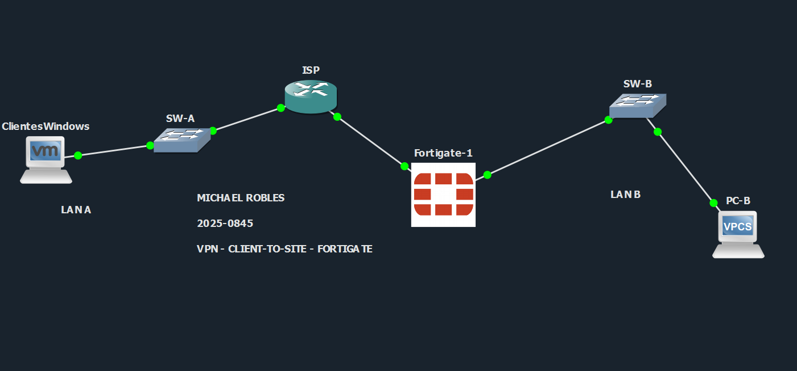

En esta topología, **ClientesWindows** representa el equipo remoto que ejecuta FortiClient. El router **ISP** simula la red intermedia entre el cliente y el FortiGate. El **FortiGate-1** recibe la VPN por la interfaz WAN `port1` y permite el acceso hacia la **LAN B** mediante la interfaz `port3`. La máquina **PC-B** representa el recurso interno que el cliente VPN debe alcanzar.

---

## Descripción general

Este repositorio contiene la documentación, evidencias y scripts de apoyo para una **VPN IPSec IKEv2 Client-To-Site** implementada con FortiGate y FortiClient.

El objetivo principal es permitir que un cliente remoto Windows Server, ubicado fuera de la red interna, pueda conectarse al FortiGate mediante una VPN y acceder a la LAN B. El cliente no recibe una IP del mismo segmento de la LAN interna, sino una IP virtual del pool VPN. Esto es correcto porque la comunicación funciona como un túnel enrutado entre el pool de clientes y la red protegida.

La comunicación validada ocurre entre:

```text
Cliente VPN: 10.25.84.10
LAN B:       192.168.45.0/24
PC-B:        192.168.45.10
```

---

## Objetivo del laboratorio

El objetivo de este laboratorio es configurar y demostrar el funcionamiento de una VPN Client-To-Site basada en IPSec IKEv2.

Para cumplir esto se implementó:

- Una topología en GNS3 con cliente remoto, ISP, FortiGate y LAN interna.
- Interfaces WAN, LAN y administración en el FortiGate.
- Rutas estáticas para permitir retorno hacia la red del cliente remoto.
- Objetos de direcciones para la LAN interna y el pool VPN.
- Un túnel IPSec IKEv2 de tipo dialup FortiClient.
- Políticas de firewall en ambos sentidos entre la VPN y la LAN B.
- Configuración de FortiClient con IKEv2, Mode Config y clave precompartida.
- Pruebas de conectividad mediante `ping`, `ipconfig`, `tracert` y `trace`.

---

## Conceptos utilizados

### VPN

Una VPN, o red privada virtual, permite que un equipo o red se comunique de forma segura a través de una red intermedia. En este laboratorio, la VPN protege la comunicación entre el cliente Windows y la LAN interna ubicada detrás del FortiGate.

### VPN Client-To-Site

Una VPN Client-To-Site conecta un cliente individual hacia una red privada. A diferencia de una VPN Site-to-Site, aquí no se conectan dos routers o dos sedes completas, sino un equipo remoto que necesita entrar a una red interna.

En este laboratorio, el cliente remoto es:

```text
Windows Server con FortiClient
```

Y la red protegida es:

```text
LAN B: 192.168.45.0/24
```

### IPSec

IPSec protege el tráfico IP mediante cifrado, autenticación e integridad. En este laboratorio, IPSec se encarga de proteger el tráfico que viaja entre el cliente VPN y el FortiGate.

### IKEv2

IKEv2 es el protocolo que negocia la seguridad del túnel. Define cómo se autentican los extremos, qué algoritmos se usan y cómo se crean las asociaciones de seguridad.

### Mode Config

Mode Config permite que el FortiGate asigne automáticamente una IP virtual al cliente VPN. Por eso el Windows Server recibe la dirección `10.25.84.10` al conectarse.

### Pool VPN separado de la LAN

El cliente VPN no tiene que usar una IP del mismo rango de PC-B. En este diseño, el cliente recibe una IP del pool `10.25.84.10-10.25.84.100`, mientras que PC-B está en `192.168.45.0/24`. El FortiGate enruta el tráfico entre ambos segmentos.

---

## Direccionamiento IP

| Dispositivo | Interfaz / Adaptador | Dirección IP | Función |
|---|---|---:|---|
| Windows Server | NIC de laboratorio | 20.25.45.10/24 | Cliente remoto antes de levantar la VPN |
| Windows Server | Adaptador FortiClient | 10.25.84.10/32 | IP virtual asignada por el FortiGate |
| ISP | Gi0/0 | 20.25.45.1/24 | Gateway de la LAN A / lado cliente |
| ISP | Gi0/1 | 20.25.8.45/30 | Enlace hacia FortiGate |
| FortiGate | port1 / WAN_HACIA_ISP | 20.25.8.46/30 | WAN que recibe la VPN |
| FortiGate | port2 / GUI | 192.168.68.250/22 | Administración / salida auxiliar |
| FortiGate | port3 / LAN_B_INTERNA | 192.168.45.1/24 | Gateway de la LAN B |
| PC-B | e0 | 192.168.45.10/24 | Equipo interno de la LAN B |

---

## Parámetros de la VPN

| Parámetro | Valor |
|---|---|
| Tipo de VPN | IPSec Client-To-Site |
| Cliente | FortiClient VPN |
| Equipo cliente | Windows Server |
| Gateway remoto | 20.25.8.46 |
| Interfaz WAN FortiGate | WAN_HACIA_ISP (port1) |
| Versión IKE | IKEv2 |
| Asignación de IP | Mode Config |
| Autenticación | Pre-Shared Key |
| EAP / Usuario | Deshabilitado |
| Pool VPN | 10.25.84.10 - 10.25.84.100 |
| Red interna permitida | 192.168.45.0/24 |
| Phase 1 | DES / SHA1 / DH14 |
| Phase 2 | DES / SHA1 / PFS desactivado |
| NAT Traversal | Habilitado |
| Políticas de firewall | C2S_TO_LANB y LANB_TO_C2S |
| NAT en políticas | Deshabilitado |

> Nota: DES/SHA1 se mantuvo por compatibilidad del laboratorio. En un entorno productivo se recomienda usar algoritmos modernos como AES y SHA-256.

---

## Estructura del repositorio

```text
VPN-Fortigate-WindowsClient-To-Site/
├── README.md
├── docs/
│   └── MichaelRobles_20250845_VPN-Fortigate-Client-To-Site-Documentacion-Tecnica-Profesional_P3.pdf
├── images/
│   ├── 01_topologia_gns3.png
│   ├── 02_fortigate_interfaces.png
│   ├── 03_fortigate_static_routes.png
│   ├── 04_fortigate_firewall_policies.png
│   ├── 05_fortigate_addresses.png
│   ├── 06_fortigate_vpn_tunnel.png
│   ├── 07_forticlient_antes_de_conectar.png
│   ├── 08_forticlient_conectado.png
│   ├── 09_ping_windows_a_pc_b.png
│   ├── 10_ipconfig_windows.png
│   ├── 11_tracert_windows_a_pc_b.png
│   ├── 12_tracert_windows_a_pc_b_repetida.png
│   ├── 13_ping_pc_b_a_cliente_vpn.png
│   └── 14_trace_pc_b_a_cliente_vpn.png
```

---

## Tutorial de configuración

Esta sección explica cómo se configuró el laboratorio y qué función cumple cada parte.

### 1. Configuración de SW-A

SW-A conecta el cliente Windows con el ISP. Se configuró como switch de acceso para mantener el lado del cliente en una VLAN local.

```cisco
hostname SW-A
no ip domain-lookup

vlan 10
 name LAN_A_CLIENTE_VPN

interface gigabitEthernet0/1
 description Hacia Windows Server Cliente VPN
 switchport mode access
 switchport access vlan 10
 spanning-tree portfast
 no shutdown

interface gigabitEthernet0/0
 description Hacia ISP Gi0/0
 switchport mode access
 switchport access vlan 10
 no shutdown
```

La interfaz `Gi0/1` conecta al Windows Server y la interfaz `Gi0/0` conecta al ISP.

### 2. Configuración de SW-B

SW-B conecta el FortiGate con PC-B. Se configuró la VLAN 20 para la LAN interna.

```cisco
hostname SW-B
no ip domain-lookup

vlan 20
 name LAN_B_INTERNA

interface gigabitEthernet0/0
 description Hacia FortiGate port3 LAN
 switchport mode access
 switchport access vlan 20
 no shutdown

interface gigabitEthernet0/1
 description Hacia PC-B LAN interna
 switchport mode access
 switchport access vlan 20
 spanning-tree portfast
 no shutdown
```

La interfaz `Gi0/0` conecta al FortiGate `port3` y la interfaz `Gi0/1` conecta a PC-B.

### 3. Configuración del ISP

El ISP simula la red intermedia. No participa en la VPN; solamente enruta entre el cliente y la WAN del FortiGate.

```cisco
hostname ISP
no ip domain-lookup
ip routing

interface gigabitEthernet0/0
 description Hacia SW-A / Cliente VPN
 ip address 20.25.45.1 255.255.255.0
 no shutdown

interface gigabitEthernet0/1
 description Hacia FortiGate port1
 ip address 20.25.8.45 255.255.255.252
 no shutdown
```

### 4. Configuración de interfaces en FortiGate

En la GUI del FortiGate se validaron las interfaces principales:

- `WAN_HACIA_ISP (port1)` con IP `20.25.8.46/30`.
- `LAN_B_INTERNA (port3)` con IP `192.168.45.1/24`.
- `GUI (port2)` con IP `192.168.68.250/22` para administración.

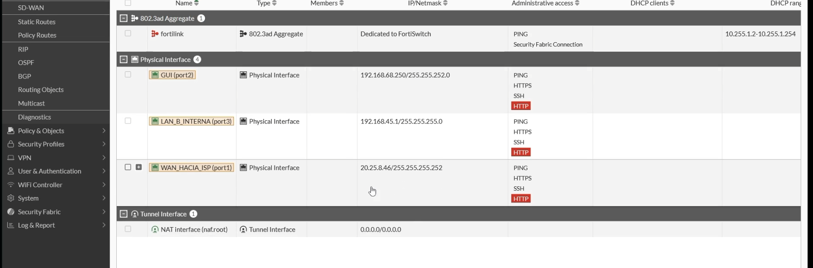

### 5. Configuración de rutas estáticas

Se configuraron dos rutas principales:

- Ruta por defecto hacia `192.168.68.1` por `GUI (port2)`.
- Ruta hacia `20.25.45.0/24` vía `20.25.8.45` por `WAN_HACIA_ISP (port1)`.

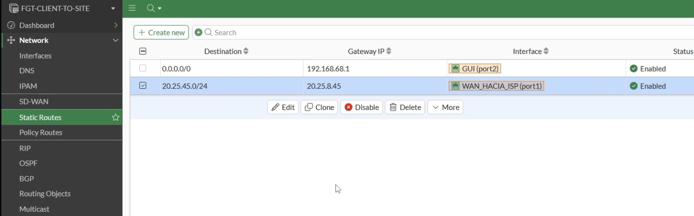

La ruta hacia `20.25.45.0/24` permite que el FortiGate responda al cliente Windows ubicado del lado del ISP.

### 6. Configuración de objetos de direcciones

Se crearon objetos para identificar las redes usadas por las políticas:

- `C2S_RANGE`: pool de clientes VPN `10.25.84.10-10.25.84.100`.
- `LAN_B_INTERNA`: red interna `192.168.45.0/24`.

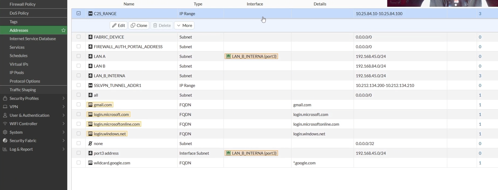

### 7. Configuración del túnel VPN

El túnel `C2S_IKE` aparece en `VPN > VPN Tunnels` dentro del grupo Dialup FortiClient. Está asociado a la interfaz `WAN_HACIA_ISP (port1)` y muestra una conexión dialup activa cuando el FortiClient se conecta.

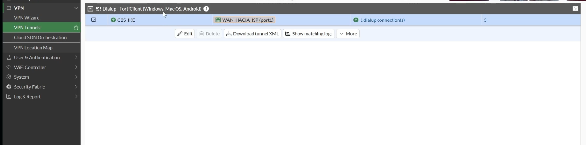

### 8. Configuración de políticas de firewall

Se configuraron dos políticas:

| Política | Origen | Destino | Función |
|---|---|---|---|
| C2S_TO_LANB | C2S_IKE / C2S_RANGE | port3 / LAN_B_INTERNA | Permite acceso del cliente VPN hacia LAN B |
| LANB_TO_C2S | port3 / LAN_B_INTERNA | C2S_IKE / C2S_RANGE | Permite respuesta y pruebas desde LAN B hacia el cliente VPN |

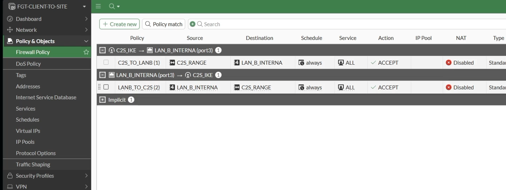

Ambas políticas tienen `ACCEPT`, servicio `ALL`, horario `always` y NAT deshabilitado.

### 9. Configuración de FortiClient

Antes de conectarse, FortiClient muestra la VPN `C2S_IKE` lista para iniciar la conexión.

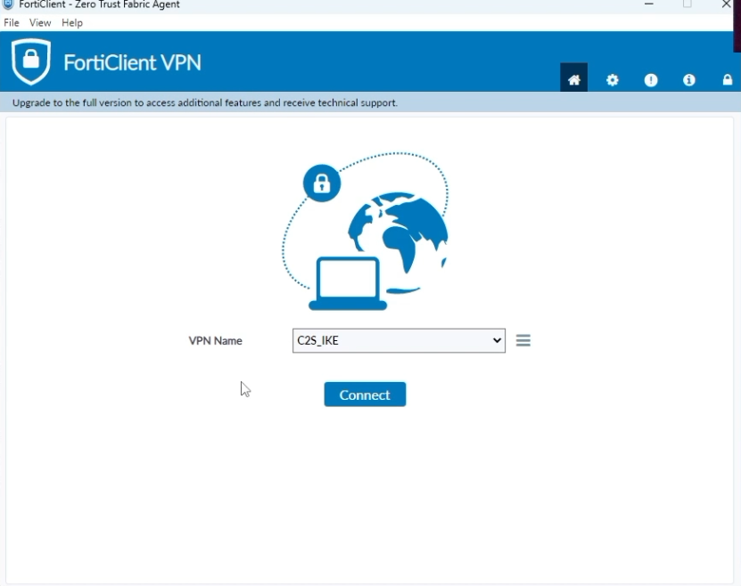

Al conectarse, FortiClient muestra estado `VPN Connected` y asigna la IP `10.25.84.10` al cliente.

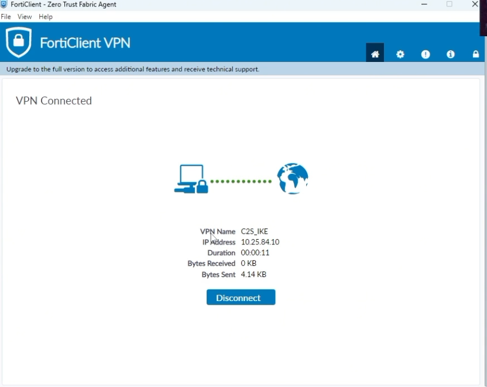

---

## Funcionamiento técnico

El funcionamiento general de la VPN es el siguiente:

1. El Windows Server tiene conectividad inicial hacia el FortiGate por medio del ISP.
2. FortiClient inicia una VPN IPSec IKEv2 hacia `20.25.8.46`.
3. El FortiGate recibe la conexión en `WAN_HACIA_ISP (port1)`.
4. IKEv2 negocia la Phase 1 y Phase 2 del túnel.
5. Mode Config asigna al cliente la IP `10.25.84.10`.
6. La política `C2S_TO_LANB` permite que el cliente VPN acceda a `192.168.45.0/24`.
7. La política `LANB_TO_C2S` permite comunicación en sentido inverso desde PC-B hacia el cliente VPN.
8. El tráfico cruza protegido por IPSec entre FortiClient y FortiGate.

---

## Evidencias

### Topología general


La topología muestra al cliente Windows en LAN A, el switch SW-A, el router ISP, el FortiGate, el switch SW-B y PC-B en LAN B. También incluye el nombre del estudiante, matrícula y el nombre del laboratorio.

### Interfaces de FortiGate


Se observan `port1`, `port2` y `port3`. La interfaz `port1` funciona como WAN hacia el ISP, `port3` funciona como LAN interna y `port2` se mantiene para administración.

### Rutas estáticas


La ruta por defecto sale por `port2`, mientras que la ruta hacia `20.25.45.0/24` sale por `port1` hacia el ISP.

### Políticas de firewall


La política `C2S_TO_LANB` permite el tráfico del cliente VPN hacia la LAN B. La política `LANB_TO_C2S` permite tráfico desde la LAN B hacia el cliente VPN.

### Objetos de direcciones


Se confirma el objeto `C2S_RANGE` con el rango `10.25.84.10-10.25.84.100` y el objeto `LAN_B_INTERNA` con la red `192.168.45.0/24`.

### VPN Tunnel activo


El túnel `C2S_IKE` aparece activo con una conexión dialup, confirmando que FortiClient se conectó correctamente.

### FortiClient antes de conectar


La conexión `C2S_IKE` está seleccionada y lista para iniciar.

### FortiClient conectado


FortiClient muestra `VPN Connected` y asigna la IP `10.25.84.10` al cliente.

### Ping desde Windows hacia PC-B

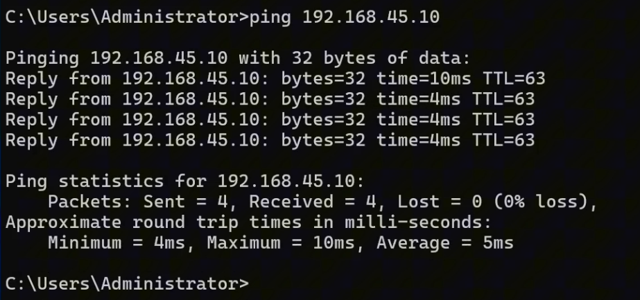

El ping hacia `192.168.45.10` responde con 0% de pérdida, validando acceso desde el cliente VPN hacia la LAN B.

### IPConfig en Windows

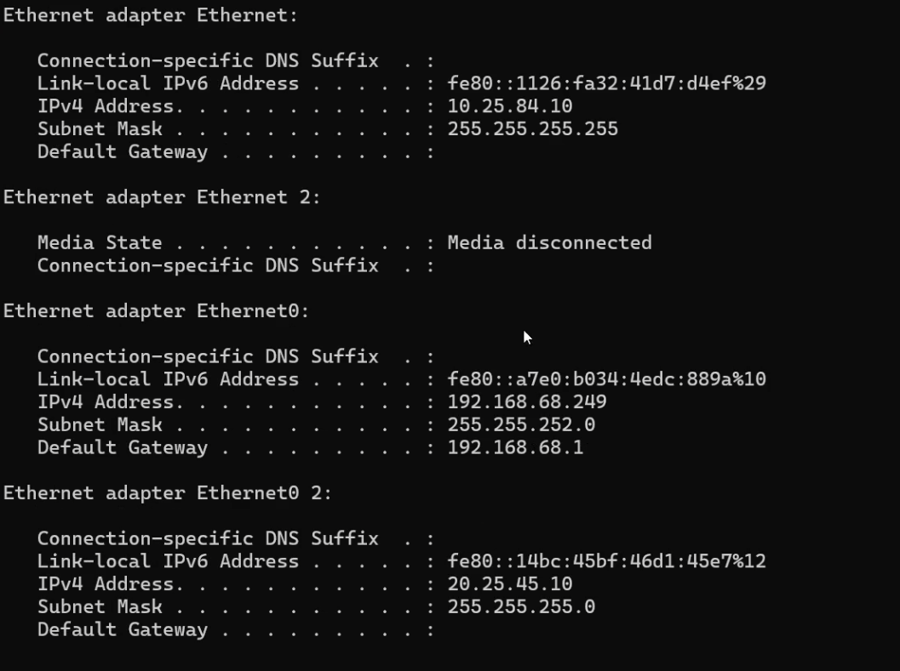

Se observa la IP VPN `10.25.84.10`, la IP de administración `192.168.68.249` y la IP del laboratorio `20.25.45.10`.

### Tracert desde Windows hacia PC-B

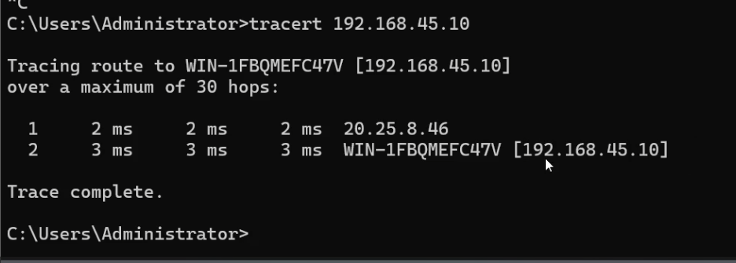

El `tracert` hacia `192.168.45.10` muestra como primer salto al FortiGate `20.25.8.46` y luego el destino final.

### Ping desde PC-B hacia el cliente VPN

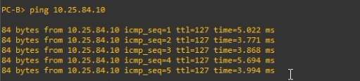

PC-B logra hacer ping a `10.25.84.10`, confirmando comunicación en sentido inverso hacia el cliente VPN.

### Trace desde PC-B hacia el cliente VPN

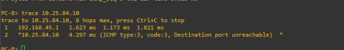

El trace muestra como primer salto al FortiGate `192.168.45.1` y luego la llegada a `10.25.84.10`. El mensaje `ICMP type:3, code:3, Destination port unreachable` es esperado en traceroute basado en UDP y confirma que el destino respondió.

---

## Comandos de verificación

En Windows Server:

```cmd
ipconfig
ping 192.168.45.10
tracert 192.168.45.10
```

En PC-B:

```text
ping 10.25.84.10
trace 10.25.84.10
```

En FortiGate GUI:

```text
Network > Interfaces
Network > Static Routes
Policy & Objects > Firewall Policy
Policy & Objects > Addresses
VPN > VPN Tunnels
```

---

## Resultado esperado

El resultado esperado es que FortiClient muestre el estado:

```text
VPN Connected
```

También se debe observar la IP asignada:

```text
10.25.84.10
```

La conectividad debe comprobarse con respuestas exitosas desde Windows hacia PC-B y desde PC-B hacia el cliente VPN.

---

## Documentación técnica profesional

La documentación completa está disponible en el siguiente enlace interno del repositorio:

[Ver documentación técnica profesional](docs/MichaelRobles_20250845_VPN-Fortigate-Client-To-Site-Documentacion-Tecnica-Profesional_P3.pdf)

También se encuentra directamente en la siguiente ubicación:

```text
docs/MichaelRobles_20250845_VPN-Fortigate-Client-To-Site-Documentacion-Tecnica-Profesional_P3.pdf
```

---

## Conclusión

La VPN IPSec IKEv2 Client-To-Site fue configurada correctamente. El Windows Server pudo conectarse al FortiGate mediante FortiClient, recibió la IP virtual `10.25.84.10` y logró comunicarse con la LAN B `192.168.45.0/24`.

Las evidencias muestran que el túnel `C2S_IKE` aparece activo en el FortiGate, que FortiClient muestra estado conectado, que el cliente puede hacer ping y traceroute hacia PC-B, y que PC-B también puede comunicarse con el cliente VPN. Esto confirma el funcionamiento correcto de la VPN Client-To-Site.

